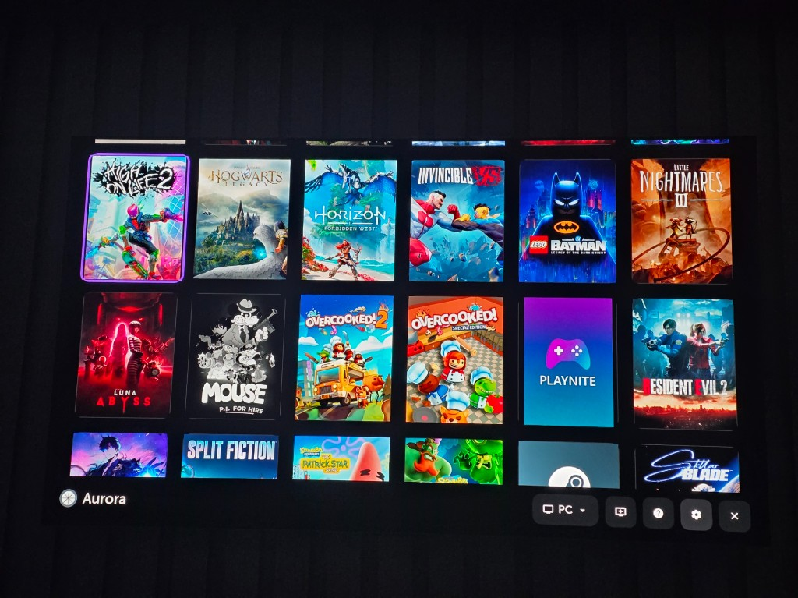
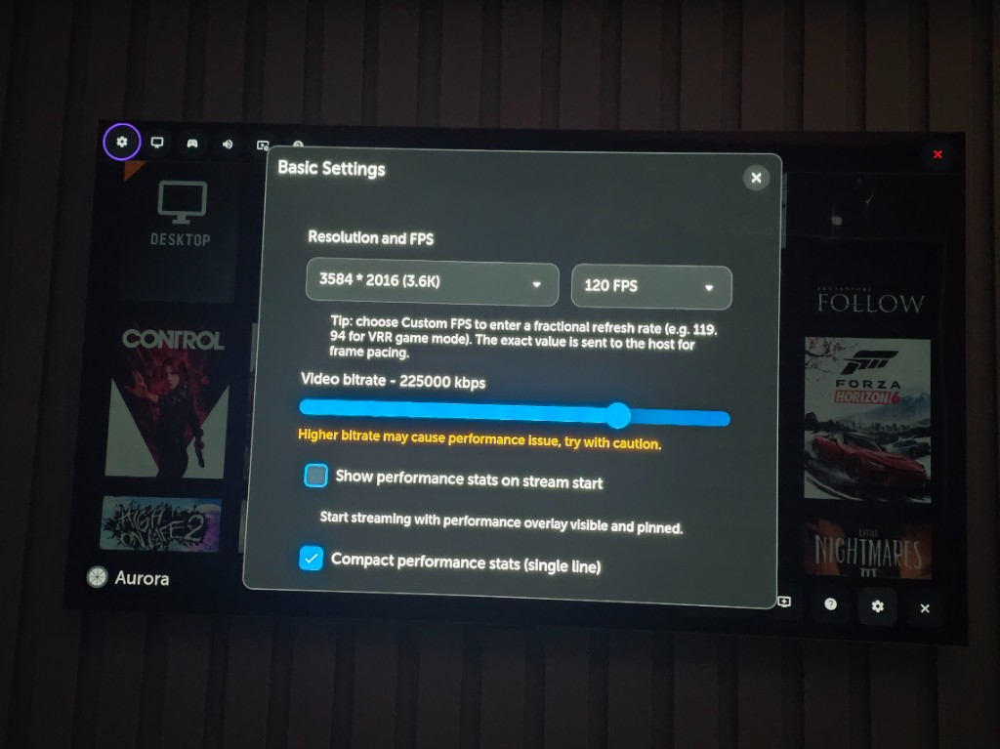
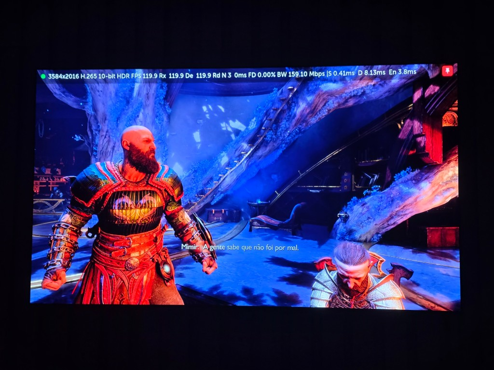
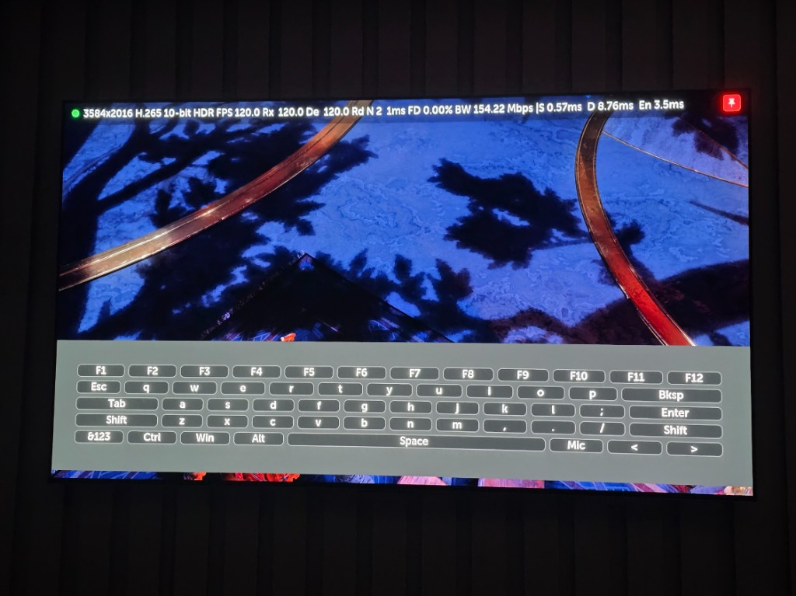
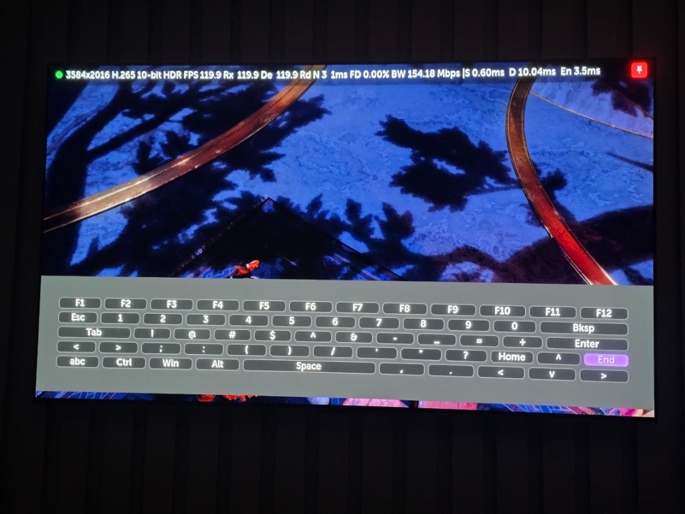

# Aurora

Unofficial fork of [Moonlight TV](https://github.com/mariotaku/moonlight-tv) for **LG webOS** (C1–C5 and compatible sets), focused on high-quality streaming on OLED TVs with a remote- and gamepad-friendly UI.

> Rights to the original project belong to [mariotaku/moonlight-tv](https://github.com/mariotaku/moonlight-tv) and the Moonlight community. Provided without warranty.

## Highlights

- **AMOLED layout** — pure black background, dark surfaces, violet accent.
- **3.6K (3584×2016)** recommended on LG C5 (stable quality without native-4K cumulative delay); **4K** when the set handles it.
- **HDR10 (PQ)** over HEVC Main10 (when supported).
- Bitrate slider up to **300 Mbps**; above **250 Mbps** there is usually no visible gain and packet loss becomes more likely as the link becomes less stable.
- **Performance stats overlay**, **full on-screen keyboard**, and **virtual mouse** during streaming.

## Screenshots

| Home | Settings |
|:---:|:---:|
|  |  |

| Performance stats | On-screen keyboard |
|:---:|:---:|
|  |  |



## Quick start

| Setting | Suggestion |
|---------|------------|
| Resolution | **3.6K** (3584×2016) on LG C5; **4K** if your set is stable at native 4K |
| FPS | 60 or 120 |
| Codec | HEVC (H.265) |
| Bitrate | Start at **120–180 Mbps**; stay at or below **250 Mbps** for a stable link. Higher values rarely help and can increase packet loss. |

## Streaming controls

**Open overlay:** Magic Remote **RED** / **EXIT**, or gamepad **LB + RB + Back + Start** (hold, then release).

| Gesture | Action |
|---------|--------|
| **Hold Select/Back 4s** | Toggle pinned performance stats |
| **Y / Triangle** (virtual mouse on) | Open on-screen keyboard |

Full keyboard: stream overlay, Magic Remote **BLUE**, or gamepad **Y** while virtual mouse is active. With the keyboard open: **Y** = Space, **LT** = abc/`&123`, **LB/RB** = Left/Right. Virtual mouse: stream overlay button (or enable in Settings → Input to start enabled); right stick = cursor, left stick = scroll, LT/RT = mouse buttons.

Details, hotkey layout, and stats field reference: [webOS build guide](docs/BUILD_WEBOS.md).

## Install

- [webOS Homebrew Channel](https://github.com/webosbrew/webos-homebrew-channel) — repo: `https://raw.githubusercontent.com/GuiDev1994/aurora-tv/main/repo.json`
- [Device Manager](https://github.com/webosbrew/dev-manager-desktop) — install the latest `.ipk` from [Releases](https://github.com/GuiDev1994/aurora-tv/releases)
- [webOS TV CLI](https://webostv.developer.lge.com/develop/tools/cli-installation) — `ares-install com.aurora.gamestream_*_arm.ipk` ([build guide](docs/BUILD_WEBOS.md))

## Build from source (developers)

Cross-compile Aurora for webOS using Docker. **Prerequisites:** Docker Desktop (Windows/macOS) or Docker Engine (Linux).

**Windows (PowerShell):**

```powershell
.\scripts\webos\build_with_docker.ps1
```

**Linux / macOS (Docker):**

```bash
docker run --rm \
  --dns 8.8.8.8 --dns 1.1.1.1 \
  -v "$(pwd):/build" \
  -v "$(pwd)/scripts/webos/docker_build_inner.sh:/docker_build.sh" \
  -w /build -e CI=1 -e DOCKER_SKIP_SUBMODULES=1 \
  ubuntu:22.04 \
  bash -c "sed 's/\r$//' /docker_build.sh | bash"
```

The `.ipk` is written to `dist/com.aurora.gamestream_<version>_arm.ipk`. To generate a Homebrew manifest locally (optional), install `webosbrew-gen-manifest` once; official [releases](https://github.com/GuiDev1994/aurora-tv/releases) build and publish the manifest via GitHub Actions.

Full build, install, and troubleshooting guide: [docs/BUILD_WEBOS.md](docs/BUILD_WEBOS.md).

## Contributors

Thanks to everyone helping improve Aurora:

- [KrisEnigma](https://github.com/KrisEnigma) — UI polish and launcher fixes ([#41](https://github.com/GuiDev1994/aurora-tv/pull/41)–[#49](https://github.com/GuiDev1994/aurora-tv/pull/49))
- [danbrun](https://github.com/danbrun) — 5.1 surround channel mapping ([#50](https://github.com/GuiDev1994/aurora-tv/pull/50), [#55](https://github.com/GuiDev1994/aurora-tv/pull/55))
- [mbenitez343](https://github.com/mbenitez343) — Opus decode guard to prevent mid-session audio loss ([#54](https://github.com/GuiDev1994/aurora-tv/pull/54))

## Credits

- Base: [mariotaku/moonlight-tv](https://github.com/mariotaku/moonlight-tv)
- Components: [moonlight-embedded](https://github.com/irtimmer/moonlight-embedded), [moonlight-common-c](https://github.com/moonlight-stream/moonlight-common-c)

## License

This project is licensed under the [GNU General Public License v3.0](LICENSE) (GPL-3.0-or-later).

Copyright and attribution details are in [COPYRIGHT](COPYRIGHT).

Aurora is a fork of [moonlight-tv](https://github.com/mariotaku/moonlight-tv), which is also licensed under GPL-3.0.
